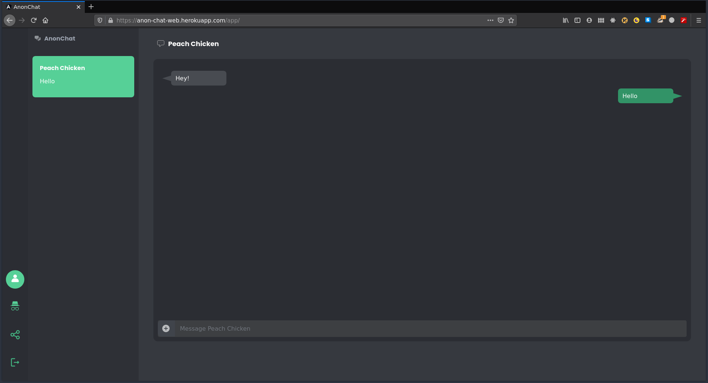

# AnnonChat

**AnonChat** is a end-to-end encrypted *(E2EE)* anonymous chatting web application.

AnonChat is made using **Angular**, **Typescript** **sass**, **tailwindcss**, **Nestjs**, **Nodejs** and **Mongodb**.
E2EE (end-to-end encryption) is acheived using Signal Protocol.

This repository contains the frontend project;
